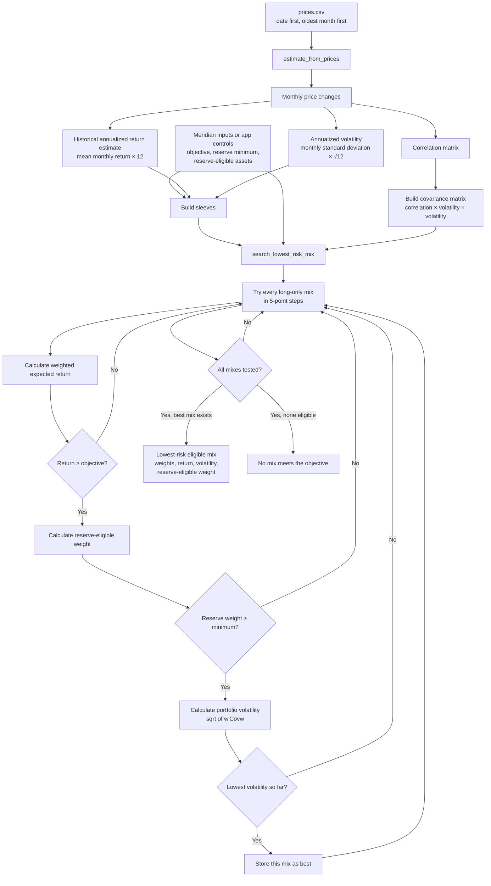

# `portfolio.py` engine

```mermaid
flowchart TD
    A[prices.csv<br/>date first, oldest month first] --> B[estimate_from_prices]
    B --> C[Monthly price changes]
    C --> D[Historical annualized return estimate<br/>mean monthly return × 12]
    C --> E[Annualized volatility<br/>monthly standard deviation × √12]
    C --> F[Correlation matrix]

    G[Meridian inputs or app controls<br/>objective, reserve minimum,<br/>reserve-eligible assets] --> H[Build sleeves]
    D --> H
    E --> H
    F --> I[Build covariance matrix<br/>correlation × volatility × volatility]

    H --> J[search_lowest_risk_mix]
    G --> J
    I --> J
    J --> K[Try every long-only mix<br/>in 5-point steps]
    K --> L[Calculate weighted expected return]
    L --> M{Return ≥ objective?}
    M -- No --> K
    M -- Yes --> N[Calculate reserve-eligible weight]
    N --> O{Reserve weight ≥ minimum?}
    O -- No --> K
    O -- Yes --> P[Calculate portfolio volatility<br/>sqrt of w'Covw]
    P --> Q{Lowest volatility so far?}
    Q -- Yes --> R[Store this mix as best]
    Q -- No --> K
    R --> K
    K --> S{All mixes tested?}
    S -- No --> K
    S -- Yes, best mix exists --> T[Lowest-risk eligible mix<br/>weights, return, volatility,<br/>reserve-eligible weight]
    S -- Yes, none eligible --> U[No mix meets the objective]
```

The return in this engine is a historical annualized estimate, not a forecast.
